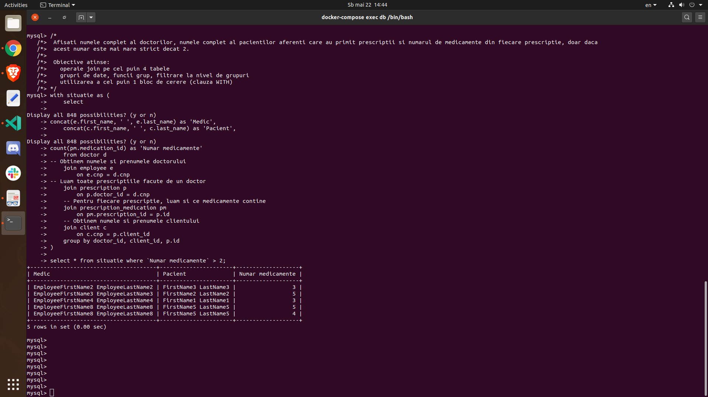
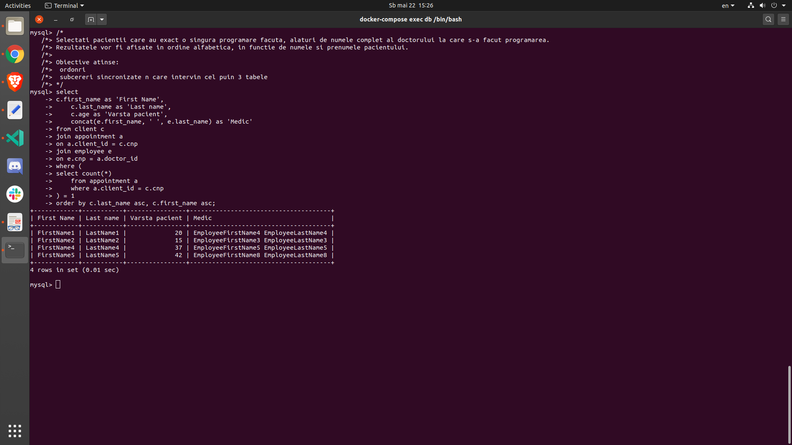
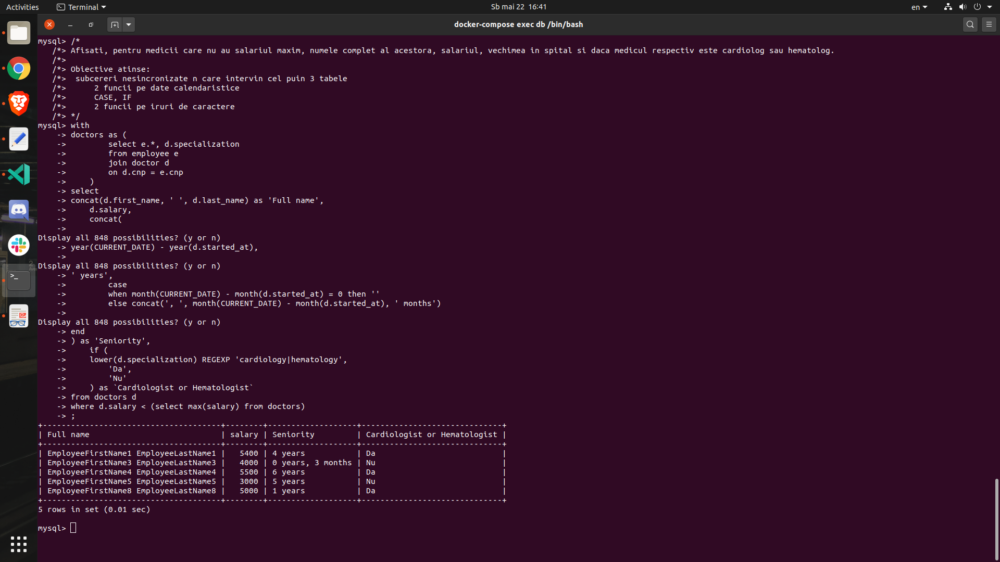
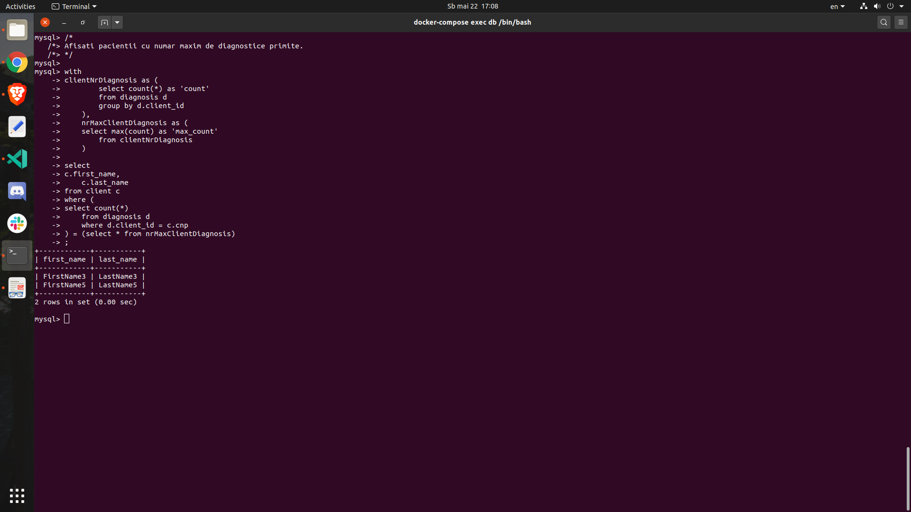
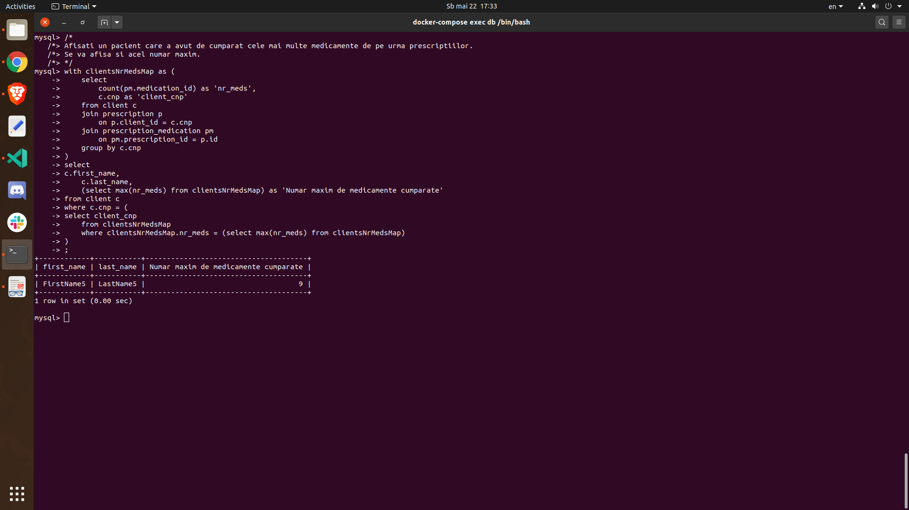
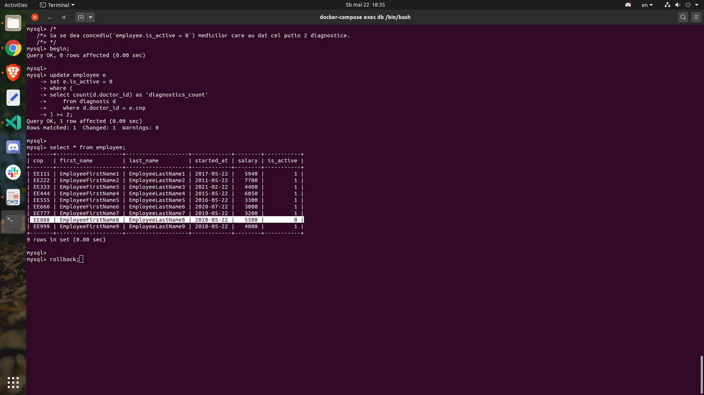
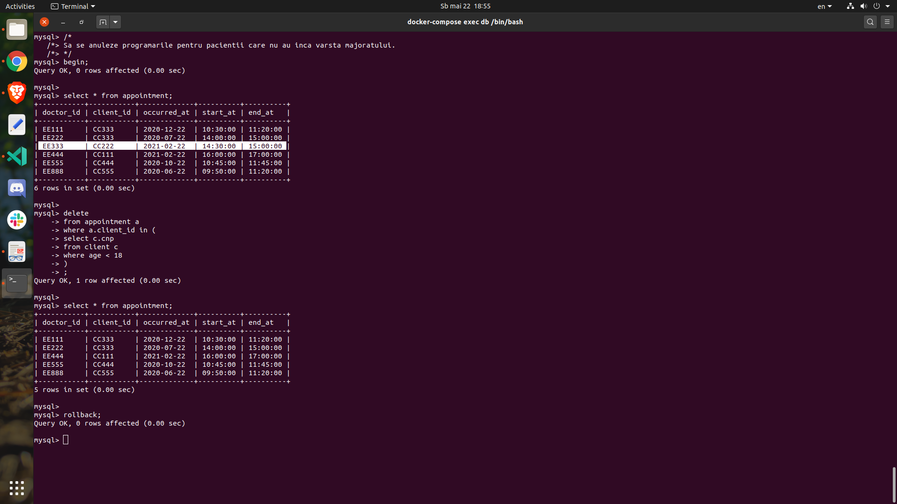
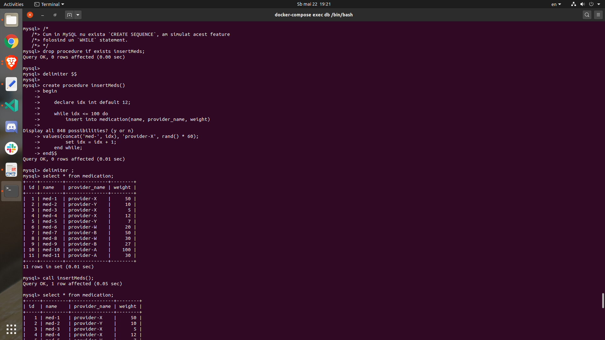
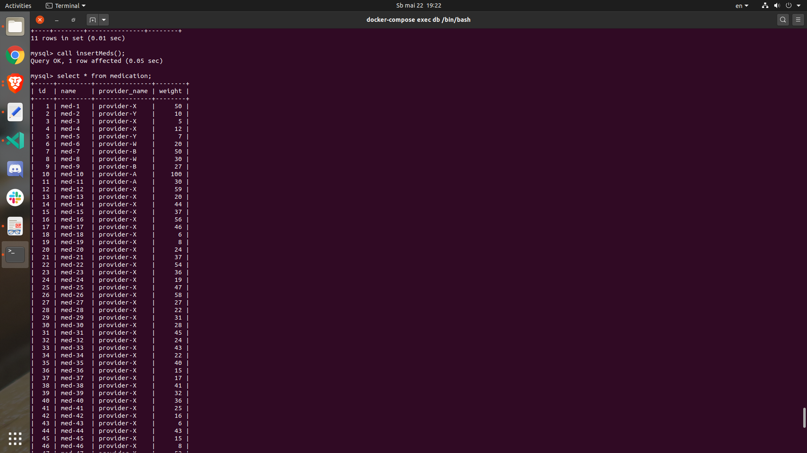
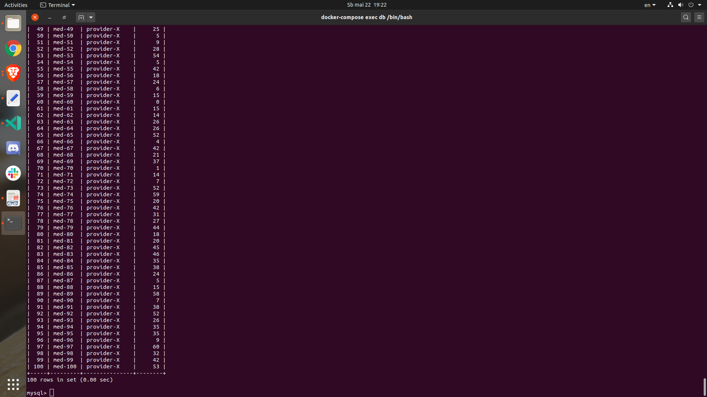

# Hospital Database Design

## Testing out

* docker-compose installed
* add how to run docker-compose & what comes after

## Tasks

### 1

> Descrierea modelului real, a utilității acestuia și a regulilor de funcționare.

Acest proiect urmareste realizarea design-ului unei baze de date a unui spital oarecare. Utilitatea acestui design este aceea ca se poate tine cu usurinta evidenta angajatilor(doctori, gardieni, receptionisti) din spital, dar si a altor obiecte: medicamente, sectiuni si cabinetele lor, prescriptii, diagnostice.

In ceea ce priveste organizarea, spitalul este impartit in sectiuni, iar fiecare sectiune exista un numar de cabinete in care doctorii isi desfasoara activitatea. In afara de doctori, in spital exista si gardieni si receptionisti. Doctorii pot face prescriptii si pot emite diagnostice pentru clientii spitalului.

### 2

> Prezentarea constrângerilor (restricții, reguli) impuse asupra modelului.

Fiecare prescriptie trebuie sa contina cel putin un medicament si este creata de catre un singur medic si destinata unui singur pacient.

Fiecare diagnostic este emis de un singur medic pentru un singur pacient.

Pentru o programare trebuie sa se cunoasca ID-ul doctorului si ID-ul pacientului.

Pentru fiecare angajat al spitalului se cunoaste programul sau de lucru.

### 3

> Descrierea entităților, incluzând precizarea cheii primare.

EMPLOYEE(id) - un angajat al spitalului, iar acesta poate fi de 3 tipuri: doctor, gardian, receptionist; pentru fiecare tip mentionat anterior exista un tabel

WORKING_SCHEDULE(employee_id) - programul de lucru al angajatilor; este un 'weak entity' intrucat depinde de entitatea 'EMPLOYEE'

CLIENT(cliend_id) - un client al spitalului

SECTION(name) - o sectie a spitalului; s-a ales numele sectiei drept cheie primara

ROOM(section_id, room_number) - un cabinet al unei sectii; este o cheie primara compusa, 'room_number' avand valori de la 1 la 'N', unde 'N' este numarul de cabinete dintr-o sectie; 'section_id' este cheia primara din tabelul 'SECTION'

MEDICATION(id) - un medicament; medicamentele apar in prescriptiile emise de medici

PRESCRIPTION(doctor_id, client_id, date) - o prescriptie; este facuta de catre un medic pentru un pacient; cheia primara este compusa deoarece o prescriptie este strans legata de medicul care a emis-o; cheia partiala este asadar 'date'(data la care s-a facut prescriptia), pentru a asigura unicitatea

DIAGNOSIS(doctor_id, client_id, date) - diagnosticul data de un doctor pentru un pacient, dar pentru ca acelasi medic poate da mai multe diagnostice aceluiasi pacient, este nevoie de o cheie partiala, 'date', pentru a asigura uncitatea

### 4

> Descrierea relațiilor, incluzând precizarea cardinalității acestora.

Intre tabelul 'EMPLOYEE' si tabelele 'DOCTOR', 'GUARDIAN' si 'RECEPTIONIST' exista cate o relatie de tipul 'ISA'.

Un **client** se poate programa la mai multi **medici** si un **medic** poate avea in grija mai multi **pacienti**('M-N').

Un **doctor** poate lucra intr-un singur **cabinet**, dar un **cabinet** poate avea mai multi **doctori**('1-N').

Un **cabinet** apartine unei **singure sectii**, dar o **sectie** poate contine mai multe **cabinete**('1-N').

Un **doctor** poate emite un numar nelimitat de **prescriptii**, dar o **prescriptie** poate fi emisa doar de un singur **doctor**('1-N').
Un **doctor** poate emite **prescriptii mai multor pacienti**, iar un **pacient** poate primi **prescriptii de la mai multi medici**('M-N').

Un **medicament** poate apartine mai multor **prescriptii**, iar o **prescriptie** poate contine mai multe **medicamente**('M-N').

Un **doctor** poate emite mai multe **diagnostice**, dar un **diagnostic** este emis doar de un singur **medic**('1-M').
Un **doctor** poate emite **diagnostice mai multor pacienti**, iar un **pacient** poate primi **diagnostice de la mai multi medici**('M-N').

### 5

> Descrierea atributelor, incluzând tipul de date și eventualele constrângeri, valori implicite, valori posibile ale atributelor.

`section.name` - acest atribut este si cheia primara a tabelului

`appointment.client_id` - pacientul care s-a programat
`appointment.doctor_id` - doctorul la care s-a programat pacientul

`prescription.id` - id-ul prescriptiei
`prescription.doctor_id` - id-ul doctorului care a creat prescriptia
`prescription.client_id` - id-ul clientului pentru care s-a creat prescriptia
`prescription_medication.medication_id` - id-ul medicamentului care apare in prescriptia cu id-ul `prescription_id`
`prescription_medication.prescription_id` - id-ul prescriptiei

`diagnosis.doctor_id` - id-ul doctorului care a emis diagnosticul
`diagnosis.client_id` - id-ul clientului care a primit diagnosticul
`diagnosis.date` - data la care s-a emis diagnosticul; acest atribut, combinat cu cele doua de mai sus, formeaza cheia primara

### 6

> Realizarea diagramei entitate-relație corespunzătoare descrierii de la punctele 3-5.

<div style="text-align: center;">
  
</div>

### 7

> Realizarea diagramei conceptuale corespunzătoare diagramei entitate-relație proiectate la punctul 6. Diagrama conceptuală obținută trebuie să conțină minimum 6 tabele (fără considerarea subentităților), dintre care cel puțin un tabel asociativ.

<div style="text-align: center;">
  
</div>

### 8

> Enumerarea schemelor relaționale corespunzătoare diagramei conceptuale proiectate la punctul 7.

* client(cnp, first_name, last_name, birthday, age)
* employee(cnp, first_name, last_name, started_at, salary, is_active)
* working_schedule(cnp, start_at, end_at)
* doctor(cnp, specialization)
* guardian(cnp, has_qualification)
* receptionist(cnp, knows_foreign_languages)
* section(name, nr_rooms)
* room(section_name, room_number, nr_beds)
* doctor_room(cnp, section_name, room_number, start_at, end_at)
* medication(id, name, provider_name, weight)
* prescription(id, doctor_id, client_id, title)
* prescription_medication(prescription_id, medication_id)
* diagnosis(doctor_id, client_id, title, description)
* appointment(doctor_id, client_id, section_name, room_number, start_at, end_at)

### 9

> Realizarea normalizării până la forma normală 3 (FN1-FN3).

Schema este in FN1:
* de-a lungul fiecarei coloane exista valori compuse dintr-un singur *cuvant*

Schema este in FN2:
* este in FN1
* nu exista **chei partiale**, adica atribute care sa depinda de o *parte* a cheii candidat; un exemplu de astfel de situatie ar fi cea in care in tabelul `prescription_medication` am avea, pe langa cele 2 *foreign keys*(`prescription_id`si `medication_id`), si atributul `weight`, care s-ar referi la greutatea unui medicament

Schema este in FN3:
* este in FN2
* nu exista **dependinte tranzitive**(daca `A -> B` si `B -> C`, atunci `A -> C`); un exemplu ar fi cazul in care in tabelul `prescription_medication` ar fi avut si atributul `provider_name`(furnizorul unui anume medicament); concret, `A` este `prescription_id`, `B` este `medication_id` si `C` este `provider_name`

### 10

> Crearea tabelelor în SQL și inserarea de date coerente în fiecare dintre acestea (minimum 5 înregistrări în fiecare tabel neasociativ; minimum 10 înregistrări în tabelele asociative).

Link-ul catre liniile relevante din fisierul SQL poate fi gasit [aici](https://github.com/Andrei0872/hospital-database-design/blob/master/db/hospital.sql#L126-L269).

### 11

> Formulați în limbaj natural și implementați 5 cereri SQL complexe ce vor utiliza, în ansamblul lor, următoarele elemente: ...

#### Cererea 1

```sql
/*
 Afisati numele complet al doctorilor, numele complet al pacientilor aferenti care au primit prescriptii si numarul de medicamente din fiecare prescriptie, doar daca
 acest numar este mai mare strict decat 2.
 
 Obiective atinse: 
  • operație join pe cel puțin 4 tabele
  • grupări de date, funcții grup, filtrare la nivel de grupuri
  • utilizarea a cel puțin 1 bloc de cerere (clauza WITH)
*/
with situatie as (
    select 
		concat(e.first_name, ' ', e.last_name) as 'Medic',
    	concat(c.first_name, ' ', c.last_name) as 'Pacient',
		count(pm.medication_id) as 'Numar medicamente'
    from doctor d
	-- Obtinem numele si prenumele doctorului
    join employee e
        on e.cnp = d.cnp
	-- Luam toate prescriptiile facute de un doctor
    join prescription p
        on p.doctor_id = d.cnp
    -- Pentru fiecare prescriptie, luam si ce medicamente contine
    join prescription_medication pm
        on pm.prescription_id = p.id
    -- Obtinem numele si prenumele clientului
    join client c
        on c.cnp = p.client_id
    group by doctor_id, client_id, p.id
)

select * from situatie where `Numar medicamente` > 2;
```

<div style="text-align: center;">
  
</div>

#### Cererea 2

```sql
/*
Selectati pacientii care au exact o singura programare facuta, alaturi de numele complet al doctorului la care s-a facut programarea.
Rezultatele vor fi afisate in ordine alfabetica, in functie de numele si prenumele pacientului.

Obiective atinse:
	• ordonări
	• subcereri sincronizate în care intervin cel puțin 3 tabele
*/
select 
	c.first_name as 'First Name',
    c.last_name as 'Last name',
    c.age as 'Varsta pacient',
    concat(e.first_name, ' ', e.last_name) as 'Medic'
from client c
join appointment a
	on a.client_id = c.cnp
join employee e
	on e.cnp = a.doctor_id
where (
	select count(*)
    from appointment a
    where a.client_id = c.cnp
) = 1
order by c.last_name asc, c.first_name asc;
```


<div style="text-align: center;">
  
</div>

#### Cererea 3

```sql
/*
Afisati, pentru medicii care nu au salariul maxim, numele complet al acestora, salariul, vechimea in spital si daca medicul respectiv este cardiolog sau hematolog.

Obiective atinse:
	• subcereri nesincronizate în care intervin cel puțin 3 tabele
    • 2 funcții pe date calendaristice
    • CASE, IF
    • 2 funcții pe șiruri de caractere
*/
with 
	doctors as (
        select e.*, d.specialization
        from employee e
        join doctor d
        	on d.cnp = e.cnp
    )
select 
	concat(d.first_name, ' ', d.last_name) as 'Full name',
    d.salary,
    concat(
		year(CURRENT_DATE) - year(d.started_at),
		' years',
        case
        	when month(CURRENT_DATE) - month(d.started_at) = 0 then ''
        	else concat(', ', month(CURRENT_DATE) - month(d.started_at), ' months')
		end
	) as 'Seniority',
    if (
    	lower(d.specialization) REGEXP 'cardiology|hematology',
        'Da',
        'Nu'
    ) as `Cardiologist or Hematologist`
from doctors d
where d.salary < (select max(salary) from doctors);
```

<div style="text-align: center;">
  
</div>

#### Cererea 4

```sql
/*
Afisati pacientii cu numar maxim de diagnostice primite.
*/

with 
	clientNrDiagnosis as (
        select count(*) as 'count'
        from diagnosis d
        group by d.client_id
    ),
    nrMaxClientDiagnosis as (
    	select max(count) as 'max_count'
        from clientNrDiagnosis
    )

select 
	c.first_name,
    c.last_name
from client c
where (
	select count(*)
    from diagnosis d
    where d.client_id = c.cnp
) = (select * from nrMaxClientDiagnosis);
```

<div style="text-align: center;">
  
</div>

#### Cererea 5

```sql
/*
Afisati un pacient care a avut de cumparat cele mai multe medicamente de pe urma prescriptiilor.
Se va afisa si acel numar maxim.
*/

with clientsNrMedsMap as (
    select 
        count(pm.medication_id) as 'nr_meds',
        c.cnp as 'client_cnp'
    from client c
    join prescription p
        on p.client_id = c.cnp
    join prescription_medication pm
        on pm.prescription_id = p.id
    group by c.cnp
)
select 
	c.first_name,
    c.last_name,
    (select max(nr_meds) from clientsNrMedsMap) as 'Numar maxim de medicamente cumparate'
from client c
where c.cnp = (
	select client_cnp
    from clientsNrMedsMap
    where clientsNrMedsMap.nr_meds = (select max(nr_meds) from clientsNrMedsMap)
);
```

<div style="text-align: center;">
  
</div>

### 12

> Implementarea a 3 operații de actualizare sau suprimare a datelor utilizând subcereri.

#### Operatia 1

```sql
/*
Sa se mareasca salariul doctorilor cu 10%.
*/
update employee e
set e.salary = (e.salary + 10/100 * e.salary)
where (
	select exists(select * from doctor d where d.cnp = e.cnp)
);
```

<div style="text-align: center;">
  
</div>

#### Operatia 2

```sql
/*
Sa se dea concediu(`employee.is_active = 0`) medicilor care au dat cel putin 2 diagnostice.
*/

begin;

update employee e
set e.is_active = 0
where (
	select count(d.doctor_id) as 'diagnostics_count'
    from diagnosis d
    where d.doctor_id = e.cnp
) >= 2;

select * from employee;

rollback;
```

<div style="text-align: center;">
  
</div>

#### Operatia 3

```sql
/*
Sa se anuleze programarile pentru pacientii care nu au inca varsta majoratului.
*/
begin;

select * from appointment;

delete
from appointment a
where a.client_id in (
	select c.cnp
	from client c
	where age < 18
)
;

select * from appointment;

rollback;
```

<div style="text-align: center;">
  
</div>

### 13

> Crearea unei secvențe ce va fi utilizată în inserarea înregistrărilor în tabele (punctul 10).

```sql
/*
Cum in MySQL nu exista `CREATE SEQUENCE`, am simulat acest feature
folosind un `WHILE` statement.
*/
drop procedure if exists insertMeds;

delimiter $$

create procedure insertMeds()
begin
    
    declare idx int default 12;

    while idx <= 100 do
        insert into medication(name, provider_name, weight)
		values(concat('med-', idx), 'provider-X', rand() * 60);
        
        set idx = idx + 1;
    end while;

end$$

delimiter ;

call insertMeds();
```

<div style="text-align: center;">
  
</div>

<div style="text-align: center;">
  
</div>

<div style="text-align: center;">
  
</div>

### 14