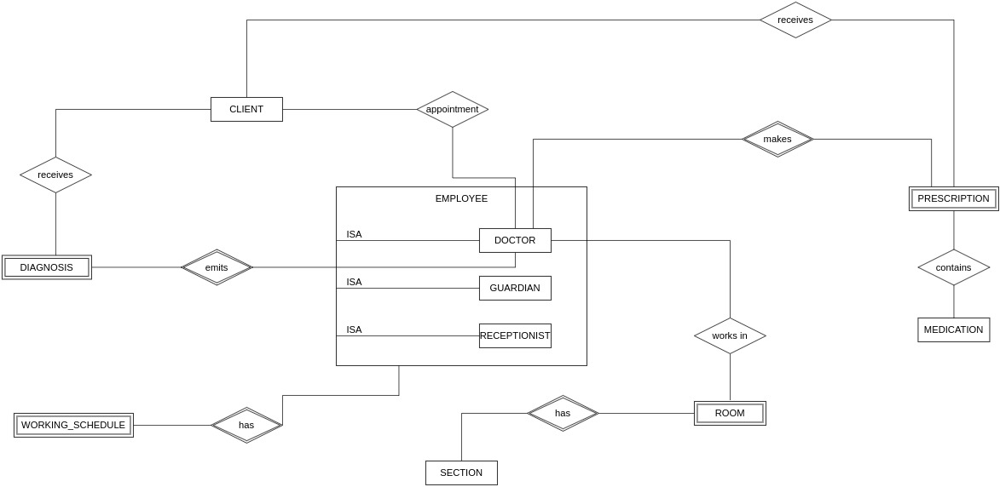
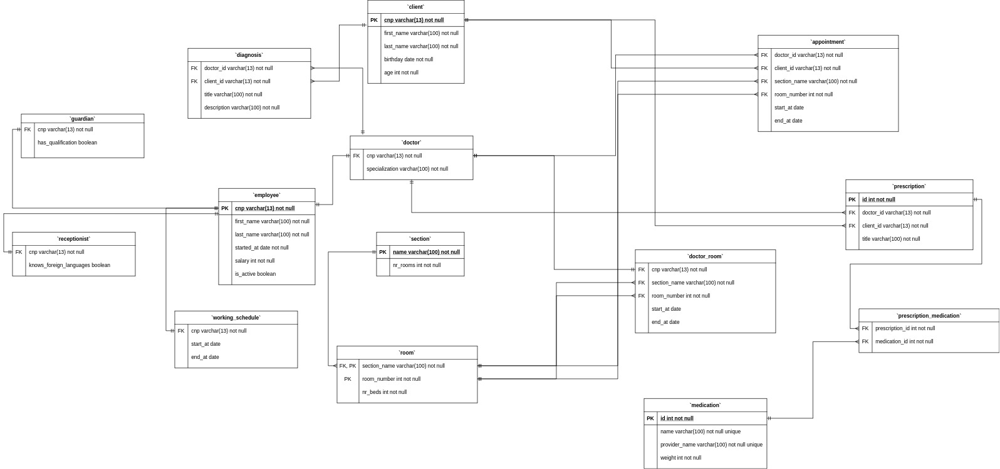

# Hospital Database Design

## Testing out

* docker-compose installed
* add how to run docker-compose & what comes after

## Tasks

### 1

> Descrierea modelului real, a utilității acestuia și a regulilor de funcționare.

Acest proiect urmareste realizarea design-ului unei baze de date a unui spital oarecare. Utilitatea acestui design este aceea ca se poate tine cu usurinta evidenta angajatilor(doctori, gardieni, receptionisti) din spital, dar si a altor obiecte: medicamente, sectiuni si cabinetele lor, prescriptii, diagnostice.

In ceea ce priveste organizarea, spitalul este impartit in sectiuni, iar fiecare sectiune exista un numar de cabinete in care doctorii isi desfasoara activitatea. In afara de doctori, in spital exista si gardieni si receptionisti. Doctorii pot face prescriptii si pot emite diagnostice pentru clientii spitalului.

### 2

> Prezentarea constrângerilor (restricții, reguli) impuse asupra modelului.

Fiecare prescriptie trebuie sa contina cel putin un medicament si este creata de catre un singur medic si destinata unui singur pacient.

Fiecare diagnostic este emis de un singur medic pentru un singur pacient.

Pentru o programare trebuie sa se cunoasca ID-ul doctorului si ID-ul pacientului.

Pentru fiecare angajat al spitalului se cunoaste programul sau de lucru.

### 3

> Descrierea entităților, incluzând precizarea cheii primare.

EMPLOYEE(id) - un angajat al spitalului, iar acesta poate fi de 3 tipuri: doctor, gardian, receptionist; pentru fiecare tip mentionat anterior exista un tabel

WORKING_SCHEDULE(employee_id) - programul de lucru al angajatilor; este un 'weak entity' intrucat depinde de entitatea 'EMPLOYEE'

CLIENT(cliend_id) - un client al spitalului

SECTION(name) - o sectie a spitalului; s-a ales numele sectiei drept cheie primara

ROOM(section_id, room_number) - un cabinet al unei sectii; este o cheie primara compusa, 'room_number' avand valori de la 1 la 'N', unde 'N' este numarul de cabinete dintr-o sectie; 'section_id' este cheia primara din tabelul 'SECTION'

MEDICATION(id) - un medicament; medicamentele apar in prescriptiile emise de medici

PRESCRIPTION(doctor_id, client_id, date) - o prescriptie; este facuta de catre un medic pentru un pacient; cheia primara este compusa deoarece o prescriptie este strans legata de medicul care a emis-o; cheia partiala este asadar 'date'(data la care s-a facut prescriptia), pentru a asigura unicitatea

DIAGNOSIS(doctor_id, client_id, date) - diagnosticul data de un doctor pentru un pacient, dar pentru ca acelasi medic poate da mai multe diagnostice aceluiasi pacient, este nevoie de o cheie partiala, 'date', pentru a asigura uncitatea

### 4

> Descrierea relațiilor, incluzând precizarea cardinalității acestora.

Intre tabelul 'EMPLOYEE' si tabelele 'DOCTOR', 'GUARDIAN' si 'RECEPTIONIST' exista cate o relatie de tipul 'ISA'.

Un **client** se poate programa la mai multi **medici** si un **medic** poate avea in grija mai multi **pacienti**('M-N').

Un **doctor** poate lucra intr-un singur **cabinet**, dar un **cabinet** poate avea mai multi **doctori**('1-N').

Un **cabinet** apartine unei **singure sectii**, dar o **sectie** poate contine mai multe **cabinete**('1-N').

Un **doctor** poate emite un numar nelimitat de **prescriptii**, dar o **prescriptie** poate fi emisa doar de un singur **doctor**('1-N').
Un **doctor** poate emite **prescriptii mai multor pacienti**, iar un **pacient** poate primi **prescriptii de la mai multi medici**('M-N').

Un **medicament** poate apartine mai multor **prescriptii**, iar o **prescriptie** poate contine mai multe **medicamente**('M-N').

Un **doctor** poate emite mai multe **diagnostice**, dar un **diagnostic** este emis doar de un singur **medic**('1-M').
Un **doctor** poate emite **diagnostice mai multor pacienti**, iar un **pacient** poate primi **diagnostice de la mai multi medici**('M-N').

### 5

> Descrierea atributelor, incluzând tipul de date și eventualele constrângeri, valori implicite, valori posibile ale atributelor.

`section.name` - acest atribut este si cheia primara a tabelului

`appointment.client_id` - pacientul care s-a programat
`appointment.doctor_id` - doctorul la care s-a programat pacientul
`appointment.section_name` - numele sectiei in care are loc programarea
`appointment.room_number` - numele cabinetului din sectia in care are loc programarea; alaturi de `section_name`, `room_number` reprezinta cheia primara din tabelul `room`

`prescription.id` - id-ul prescriptiei
`prescription.doctor_id` - id-ul doctorului care a creat prescriptia
`prescription.client_id` - id-ul clientului pentru care s-a creat prescriptia
`prescription_medication.medication_id` - id-ul medicamentului care apare in prescriptia cu id-ul `prescription_id`
`prescription_medication.prescription_id` - id-ul prescriptiei

`diagnosis.doctor_id` - id-ul doctorului care a emis diagnosticul
`diagnosis.client_id` - id-ul clientului care a primit diagnosticul
`diagnosis.date` - data la care s-a emis diagnosticul; acest atribut, combinat cu cele doua de mai sus, formeaza cheia primara

### 6

> Realizarea diagramei entitate-relație corespunzătoare descrierii de la punctele 3-5.

  

### 7

> Realizarea diagramei conceptuale corespunzătoare diagramei entitate-relație proiectate la punctul 6. Diagrama conceptuală obținută trebuie să conțină minimum 6 tabele (fără considerarea subentităților), dintre care cel puțin un tabel asociativ.

  

### 8

> Enumerarea schemelor relaționale corespunzătoare diagramei conceptuale proiectate la punctul 7.

* client(cnp, first_name, last_name, birthday, age)
* employee(cnp, first_name, last_name, started_at, salary, is_active)
* working_schedule(cnp, start_at, end_at)
* doctor(cnp, specialization)
* guardian(cnp, has_qualification)
* receptionist(cnp, knows_foreign_languages)
* section(name, nr_rooms)
* room(section_name, room_number, nr_beds)
* doctor_room(cnp, section_name, room_number, start_at, end_at)
* medication(id, name, provider_name, weight)
* prescription(id, doctor_id, client_id, title)
* prescription_medication(prescription_id, medication_id)
* diagnosis(doctor_id, client_id, title, description)
* appointment(doctor_id, client_id, section_name, room_number, start_at, end_at)

### 9

> Realizarea normalizării până la forma normală 3 (FN1-FN3).

Schema este in FN1:
* de-a lungul fiecarei coloane exista valori compuse dintr-un singur *cuvant*

Schema este in FN2:
* este in FN1
* nu exista **chei partiale**, adica atribute care sa depinda de o *parte* a cheii candidat; un exemplu de astfel de situatie ar fi cea in care in tabelul `prescription_medication` am avea, pe langa cele 2 *foreign keys*(`prescription_id`si `medication_id`), si atributul `weight`, care s-ar referi la greutatea unui medicament

Schema este in FN3:
* este in FN2
* nu exista **dependinte tranzitive**(daca `A -> B` si `B -> C`, atunci `A -> C`); un exemplu ar fi cazul in care in tabelul `prescription_medication` ar fi avut si atributul `provider_name`(furnizorul unui anume medicament); concret, `A` este `prescription_id`, `B` este `medication_id` si `C` este `provider_name`

### 10
### 11
### 12
### 13
### 14